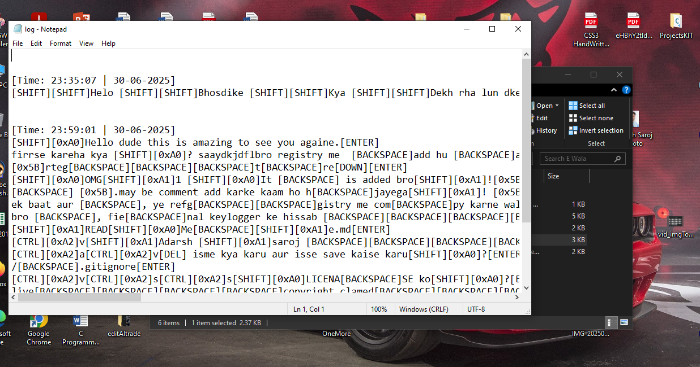
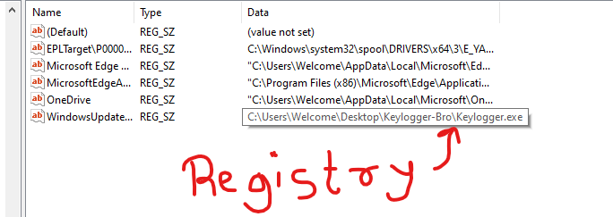

# 🔐 Windows Keylogger in C

This is a simple yet powerful **Windows keylogger** written entirely in C using the Windows API (WinAPI).  
It runs silently in the background, logs every keystroke with proper handling of `Shift` and `Caps Lock`, and even adds itself to Windows Startup via the Registry — all without external dependencies.

---

## 🚀 Features

✅ **Stealth Mode** — Hides the console window immediately on execution  
✅ **Keystroke Logging** — Records all keys including alphabets, numbers, symbols, and special keys  
✅ **Shift + Caps Lock Detection** — Handles uppercase, lowercase, and symbols accurately  
✅ **Timestamps** — Adds a date/time stamp before the first keystroke of each session  
✅ **Auto Startup** — Adds itself to Windows Registry to start automatically on boot  
✅ **No Dependencies** — Written in pure C using standard Windows libraries (`user32`, `advapi32`)  
✅ **Log File** — Logs are stored in `log.txt` in the same directory as the executable

---

## 🧠 How It Works

1. **Hides the console window** using `GetConsoleWindow()` and `ShowWindow(SW_HIDE)`
2. Registers a system shutdown handler to safely close the logger
3. Uses `GetAsyncKeyState()` to detect keypresses
4. Checks if Shift or Caps Lock is on to determine the correct case/symbol
5. Writes keystrokes to `log.txt` with time and date
6. Automatically adds itself to the `HKEY_CURRENT_USER\Software\Microsoft\Windows\CurrentVersion\Run` registry key, so it runs on every system boot

---

## 🛠️ Compilation Instructions

> You need a C compiler like **GCC (MinGW)** on Windows.

### 🔧 Compile using MinGW:

```bash
gcc keylogger.c -o keylogger.exe -luser32 -ladvapi32

### 🔍 Tags

`keylogger` `windows` `winapi` `c language` `keystroke logger` `startup registry` `cybersecurity` `system programming`

## 📸 Screenshots

🔹 **Log File Preview**  


🔹 **Keylogger Running Silently**  

